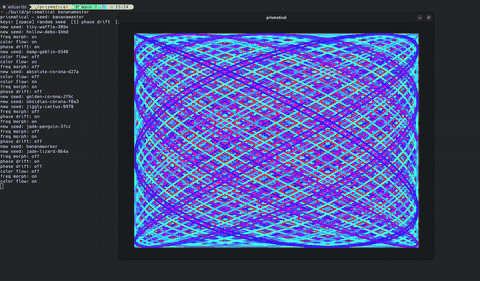

# prismatical

A psychedelic[ish] seed based (for now) visual synthesizer with aNiMaTioOOn.

<div align="center">
  
</div>

## What it does

- Takes/Generates a string as a **seed** and generates an unique canva from it
- The seed controls the shape the frequenceis and the starting/transition color palette
- You can animate the visual in real time using keyboard toggles

## Why?
It has been a long time since I don't touch C++ so this is a funny and tryppy way to get used to it again. Besides that, I have no clue. Maybe I do. Most likely it is my artistic side giving glimpses of development or it is just a nice way to waste my time. Only time will answer.

## Build

Requires: `cmake`, `make`, `SDL2`

```bash
mkdir build && cd build
cmake ..
make
```

## Run

```bash
./prismatical                # default seed
./prismatical Ineedholidays  # your own seed
```

## Controls

| Key       | Action                                      |
|-----------|---------------------------------------------|
| `space`   | Generate a random seed                      |
| `1`       | Toggle **phase drift** — the shape breathes |
| `2`       | Toggle **color flow** — hues rotate along the curve |
| `3`       | Toggle **freq morph** — the shape warps     |
| `escape`  | Quit                                        |

You can also type any word directly in the terminal and press Enter to jump to that seed.


## Available configs

All visual parameters live in `src/config.h` so you don't need to investigate this code. You can trust this repo I guarantee there is no crypto mining stuff or deep scan to steal your data.

| Constant           | What it does                                      |
|--------------------|---------------------------------------------------|
| `COLOR_HUE_SPREAD` | How wide the color swings are (degrees)           |
| `COLOR_HUE_CYCLES` | How many color patches appear along the curve     |
| `COLOR_SATURATION` | Color intensity (0 = grey, 1 = vivid)             |
| `ANIM_PHASE_SPEED` | How fast the shape breathes                       |
| `ANIM_COLOR_SPEED` | How fast the colors rotate                        |
| `ANIM_FREQ_SPEED`  | How fast the shape warps                          |
| `CURVE_STEPS`      | Curve density — more steps = smoother but slower  |


## Roadmap

### Fractals
Fractal generators alongside the existing wave patterns. Same seed-based approach producing an unique fractal with its own identity.

### Audio input & FFT
Feed a song or microphone input. The idea is that the audio will be broken into its frequency components in real time using FFT, and those frequencies directly drive the visuals in some kind of pattern. It could be e.g. bass shakes the shape, mids shift the colors, highs add detail and motion.

### Real time audio reactive animation
Every pattern change via fft becomes a visual event. Shape, color, speed and pattern all respond live to what the audio is doing reacting to the full frequency spectrum continuously.

### Style fingerprint
The idea here is to try to identify patterns and classify the audio based on its frequency distribution. The synthesizer could identifies recurring patterns energy, rhythm, harmonic structure and maps them to a similar visual style based on the group classification. Similar sounds get similar looking visuals. Different genres look clearly different. A funny name rotule would be cool as well.

### ESP32 ?
Maybe some crazy future stuff will happen here.


## Stack

- **C++23** — language
- **SDL2** — window and pixel rendering
- **CMake** — build system

### Platform support

| Platform | Status |
|----------|--------|
| Linux (native) | Working |
| Windows        | Hell no |
| MacOs          | It should work |
| WASM / Browser | Planned — the goal is to compile for WASM and embed directly in a webpage, but the web shell and browser rendering layer are not built yet |

Development happens on Linux first. Once features are stable empirically, based on my judgment, the WASM target will be added so the synthesizer can run in a browser with no install required (I hope).
